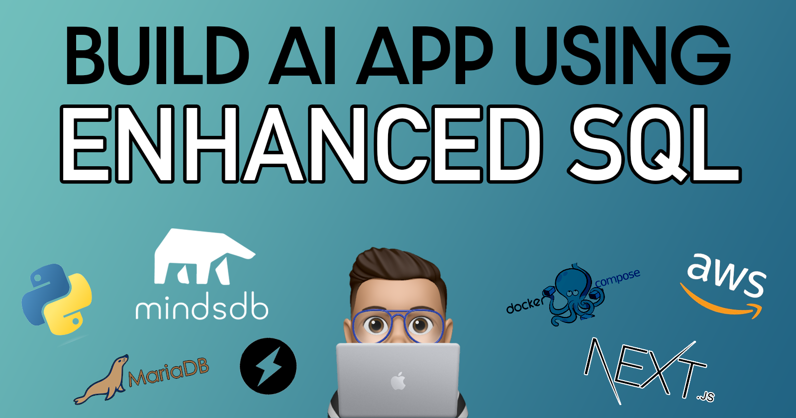
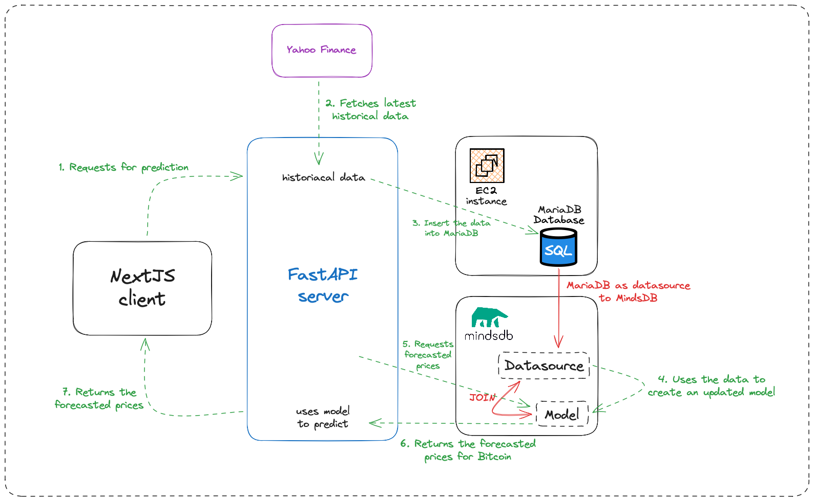
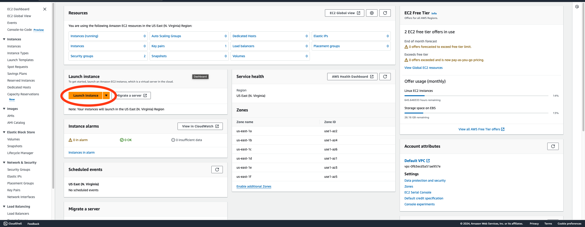
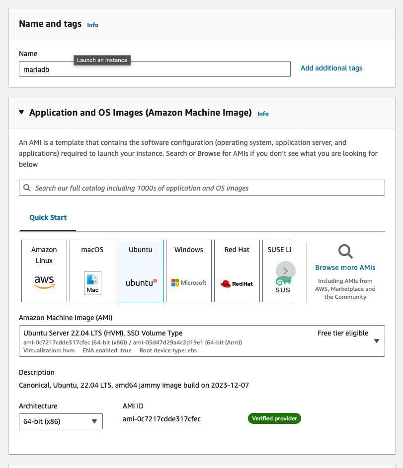
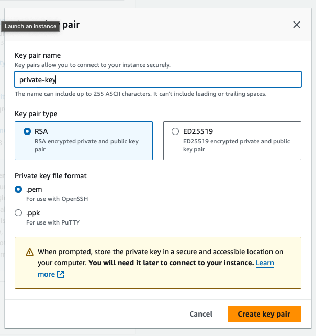

<a name="readme-top"></a>

<!-- PROJECT LOGO -->
<br />
<div align="center">
  <a href="https://github.com/ayushgml/ai-btc-prediction-mindsdb.git">
  
  </a>

  <h1 align="center">Bitcoin predicting AI using SQL</h1>

  <p align="center">
    A fullstack applicationthat uses MindsDB, MariaDB, FastAPI, Docker, AWS EC2 and NextJS to predict the price of Bitcoin.
</div>



## About The Project

This project is a fullstack application that uses MindsDB, MariaDB, FastAPI, Docker, AWS EC2 and NextJS to predict the price of Bitcoin. The project is divided into 4 parts:
 - A MariaDB database that stores the historical data of Bitcoin(hosted on EC2 instance)
 - MindsDB that uses the data from the database to train a model and make predictions
 - A FastAPI server that serves the predictions from MindsDB
 - A NextJS frontend that displays the predictions from the FastAPI server

## Built With

 - [MindsDB](https://mindsdb.com/)
 - [MariaDB](https://mariadb.org/)
 - [FastAPI](https://fastapi.tiangolo.com/)
 - [NextJS](https://nextjs.org/)
 - [Docker](https://www.docker.com/)
 - [AWS EC2](https://aws.amazon.com/ec2/)

## Project Structure

```
.
├── README.md
├── assets
│   ├── cover.png
│   └── mindsdb-arch.png
├── backend
│   ├── Dockerfile
│   ├── env.py
│   ├── main.py
│   └── requirements.txt
├── compose.yaml
├── config-mariadb
│   └── compose.yaml
├── connect.sh
├── frontend
│   ├── Dockerfile
│   ├── next-env.d.ts
│   ├── next.config.js
│   ├── node_modules
│   ├── package-lock.json
│   ├── package.json
│   ├── postcss.config.js
│   ├── public
│   ├── src
│   ├── tailwind.config.ts
│   └── tsconfig.json
├── mindsdb.sql
├── private
│   └── maria-secret-key.pem
├── sample-docker-compose.yaml
└── venv
    ├── bin
    ├── etc
    ├── include
    ├── lib
    ├── pyvenv.cfg
    └── share
```

## Architecture and Working




## Installation and Running the Project

### Prerequisites

 - Docker
 - Docker Compose
 - AWS EC2 Instance

### Installation
1. <b>Spinning up EC2 instance on your AWS account</b>
   - Go to AWS EC2 console and click on Launch Instance <br>
    
   - Name the instance `mariadb` and select the instance type as `t2.micro` (both are free tier eligible) <br><br>
    <div align="center">
      
    </div>
   - Select the latest Ubuntu Server 20.04 LTS (HVM), SSD Volume Type AMI
   - Create a new key pair called `maria-secret-key` and download the `.pem` file into a new folder named private/ in your project directory<br><br>
    <div align="center">
      
    </div>

   - Configure the EBS storage to 30GB(this is also under the free tier)
   - Launch the instance

2. <b>Setting up MariaDB on the EC2 instance</b>
   1. Go to your EC2 instance and copy the public IPv4 address of your instance
   2. Open `connect.sh` and replace the IP address in the file with your instance's IP address
   3. Make the file executable by running `chmod +x connect.sh`
   4. Run the file by running `./connect.sh`
   5. If prompted for fingerprinting type `yes`
   6. Escalate to root user by running `sudo su`
   7. Install docker on instance by running `curl -fsSL https://get.docker.com | sudo sh`
   8. Once docker is installed make a compose.yaml file by running `touch compose.yaml`
   9. Copy the contents of `config-mariadb/compose.yaml` into the `compose.yaml` file by running `nano compose.yaml` and pasting the contents
   10. Make a .env file by running `touch .env`
   11. Edit the .env file by running `nano .env` and typing in the following:
   12. Save the file and exit
   13. Give access on port 3306 over TCP from any IP from your EC2 instance console to allow access to MariaDB
3. <b> Setting up MindsDB on your local machine</b>
   1. open your terminal run: 
      ```
      docker run -d -p 47334:47334 -p 47335:47335 --name mindsdb mindsdb/mindsdb
      ```
   2. Now run the followingcommand to create a database in mindsdb (Replace YOUR_EC2_PUBLIC_IP with your EC2 instance's public IP and YOUR_ROOT_PASSWORD with the password you set for your MariaDB instance):
      ```
      curl -X POST http://localhost:47334/api/sql/query -H "Content-Type: application/json" -d '{"query": "CREATE DATABASE btc_datasource\nWITH\n  engine = '\''mariadb'\'',\n  parameters = {\n    \"host\": \"YOUR_EC2_PUBLIC_IP\",\n    \"port\": 3306,\n    \"database\": \"btc_price\",\n    \"user\": \"root\",\n    \"password\": \"YOUR_ROOT_PASSWORD\"\n  };"\'}'
      ```

4. <b>Setting up the backend server</b>
    1. Create a virtual environment by running `python3 -m venv venv`
    2. Activate the virtual environment by running `source venv/bin/activate`
    3. Go to the backend directory by running `cd backend`
    4. Make a .env file by running `touch .env`
    5. Edit the .env file by running `nano .env` and typing in the following:
      ```
      MARIADB_DATABASE_URL=mysql://root:<your-mariadb-pass>@<your-ec2-ip-address>/btc_price
      MINDSDB_URL=http://localhost:47334/api/sql/query 
      ```
    6. Install the dependencies by running `pip install -r requirements.txt`
    7. Run the server by running `uvicorn main:app --reload`
    8. The server should be running on `http://localhost:8000`
5. <b> Setting up the frontend server</b>
    1. Open another terminal and go to the frontend directory by running `cd frontend`
    2. Install the dependencies by running `npm install`
    3. Run the server by running `npm run dev`
    4. The server should be running on `http://localhost:3000`
6. Your app should be running on `http://localhost:3000` and you should be able to see the predictions on the frontend!


## Contribution
The project is open to contributions. Feel free to open a pull request or an issue if you find a bug or want to add a feature.


## Contact

Ayush Gupta - [@itsayush\_\_](https://twitter.com/itsayush__) - ayushgml@gmail.com

[Project link](https://github.com/ayushgml/ai-btc-prediction-mindsdb.git)

